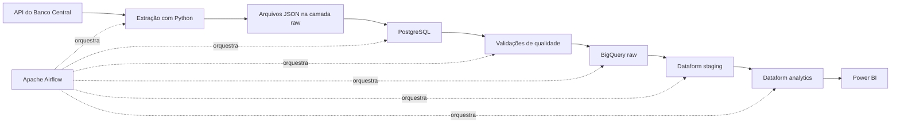

# 🇧🇷 Data Pipeline Brasil

Pipeline de engenharia de dados de ponta a ponta para coleta, processamento, validação e análise de indicadores econômicos brasileiros.

O projeto utiliza a taxa Selic diária disponibilizada pelo Banco Central do Brasil para demonstrar uma arquitetura moderna com Python, PostgreSQL, Docker, Apache Airflow, BigQuery, Dataform e Power BI.

## Visão geral

O pipeline executa o seguinte fluxo:



O DAG principal é executado diariamente às **06:00**, no fuso `America/Sao_Paulo`.

## Objetivos

Este projeto foi desenvolvido para demonstrar competências em:

- extração de dados de APIs públicas;
- criação de pipelines idempotentes;
- armazenamento em PostgreSQL e BigQuery;
- modelagem em camadas `raw`, `staging` e `analytics`;
- transformações SQL com Dataform;
- validações automatizadas de qualidade;
- orquestração com Apache Airflow;
- testes automatizados com Pytest;
- construção de dashboard analítico no Power BI;
- versionamento e documentação com Git e GitHub.

## Tecnologias

| Camada | Tecnologia |
|---|---|
| Extração e carga | Python |
| Banco relacional | PostgreSQL |
| Containers | Docker e Docker Compose |
| Orquestração | Apache Airflow |
| Data warehouse | Google BigQuery |
| Transformações em nuvem | Dataform |
| Testes | Pytest |
| Qualidade de código | Ruff |
| Visualização | Power BI |
| Versionamento | Git e GitHub |

## Fonte de dados

Os dados são extraídos da API SGS do Banco Central do Brasil.

- Indicador: taxa Selic diária
- Código da série: `11`
- Formato de origem: JSON
- Periodicidade do pipeline: diária

Cada extração é armazenada com metadados de origem, período consultado, horário de extração e quantidade de registros.

## Arquitetura em camadas

### Camada raw

Preserva os dados próximos ao formato de origem e mantém o payload recebido da API.

Principais destinos:

- `data/raw/selic_*.json`
- `raw.selic` no PostgreSQL
- `raw.selic` no BigQuery

### Camada staging

Padroniza os dados e prepara os tipos utilizados nas análises.

Objeto principal:

```text
staging.selic_daily
```

### Camada analytics

Disponibiliza dados prontos para consumo analítico.

Objetos principais:

```text
analytics.selic_daily_metrics
analytics.selic_monthly
```

Métricas produzidas:

- taxa diária;
- taxa do dia anterior;
- variação diária;
- média móvel de sete observações;
- quantidade de observações por mês;
- taxas média, mínima e máxima mensal;
- primeira e última data disponível no mês.

## Qualidade de dados

O pipeline interrompe a execução quando encontra inconsistências relevantes.

As validações incluem:

- duplicidade por data de referência;
- campos obrigatórios nulos;
- taxas menores ou iguais a zero;
- datas futuras;
- divergência de quantidade entre as camadas;
- ausência de registros na tabela raw;
- unicidade e não nulidade por meio de assertions do Dataform.

## Orquestração com Airflow

O DAG `selic_bcb_pipeline` executa as tarefas abaixo de forma sequencial:

```text
extract_selic
    ↓
load_postgres
    ↓
transform_selic
    ↓
validate_quality
    ↓
load_bigquery
    ↓
compile_dataform
    ↓
run_dataform
    ↓
wait_dataform
```

A configuração atual do ambiente de portfólio compila o workspace `dev-leo` do Dataform. Uma evolução futura é utilizar uma release configuration ou integração Git dedicada para o ambiente de produção.

## Dashboard no Power BI

O relatório consome exclusivamente a camada `analytics` do BigQuery.

Principais elementos do painel:

- última taxa diária disponível;
- data da última observação;
- total de observações;
- evolução diária da Selic;
- média móvel de sete observações;
- variação diária;
- resumo mensal com taxas média, mínima e máxima;
- narrativa dinâmica que responde aos filtros do relatório.

O arquivo `.pbix` pode ser executado localmente no Power BI Desktop. A publicação no Power BI Service é opcional e depende de uma conta corporativa ou educacional compatível.

## Estrutura do projeto

```text
data-pipeline-brasil/
├── airflow/
│   ├── dags/
│   │   └── selic_bcb_pipeline.py
│   ├── Dockerfile
│   ├── docker-compose.airflow.yaml
│   └── requirements-airflow.txt
├── data/
│   └── raw/
├── docs/
├── notebooks/
├── powerbi/
├── sql/
│   ├── bigquery/
│   ├── 001_create_raw_selic.sql
│   ├── 002_create_selic_analytics.sql
│   └── 003_data_quality_checks.sql
├── src/
│   ├── extract/
│   ├── load/
│   ├── pipeline/
│   ├── quality/
│   └── transform/
├── tests/
├── .env.example
├── compose.yaml
├── pytest.ini
├── requirements.txt
└── README.md
```

## Executando localmente

### Pré-requisitos

- Git
- Python
- Docker Desktop
- Google Cloud CLI, para as etapas em nuvem

### 1. Clone o repositório

```bash
git clone https://github.com/Leos227/data-pipeline-brasil.git
cd data-pipeline-brasil
```

### 2. Crie o ambiente virtual

No PowerShell:

```powershell
python -m venv .venv
.\.venv\Scripts\Activate.ps1
python -m pip install -r requirements.txt
```

### 3. Configure as variáveis de ambiente

```powershell
Copy-Item .env.example .env
```

Preencha o `.env` com as configurações locais e do Google Cloud.

Nunca envie arquivos `.env`, chaves JSON ou credenciais para o repositório.

### 4. Inicie o PostgreSQL

```powershell
docker compose up -d
```

### 5. Execute o pipeline local

```powershell
python -m src.pipeline.run_pipeline
```

### 6. Execute os testes

```powershell
pytest
```

## Executando o Airflow

Inicialize os serviços:

```powershell
docker compose `
  -p data-pipeline-airflow `
  --env-file airflow\.env `
  -f airflow\docker-compose.airflow.yaml `
  up -d --build
```

A interface ficará disponível em:

```text
http://localhost:8080
```

Para verificar erros de importação do DAG:

```powershell
docker compose `
  -p data-pipeline-airflow `
  --env-file airflow\.env `
  -f airflow\docker-compose.airflow.yaml `
  exec airflow-scheduler `
  airflow dags list-import-errors
```

## Segurança

O projeto utiliza Application Default Credentials no ambiente local para autenticação com o Google Cloud.

Nenhuma credencial permanente deve ser versionada. Arquivos sensíveis permanecem fora do Git por meio do `.gitignore`.

## Status

- [x] Ambiente local configurado
- [x] Extração da API do Banco Central
- [x] Persistência em JSON
- [x] Carga idempotente no PostgreSQL
- [x] Transformações SQL locais
- [x] Validações de qualidade
- [x] Pipeline executável por um único comando
- [x] Testes automatizados
- [x] Orquestração com Airflow
- [x] Carga no BigQuery
- [x] Transformações com Dataform
- [x] Assertions no Dataform
- [x] Dashboard no Power BI
- [ ] Publicação opcional no Power BI Service

## Próximas melhorias

- adicionar novos indicadores econômicos;
- criar uma release configuration no Dataform;
- adicionar CI com GitHub Actions;
- incluir monitoramento e alertas de falha;
- publicar o dashboard quando houver uma conta compatível com o Power BI Service;
- criar documentação visual completa da arquitetura.

## Autor

**Leonardo Sousa da Silva**

Projeto desenvolvido para estudo, portfólio e demonstração prática de engenharia de dados.